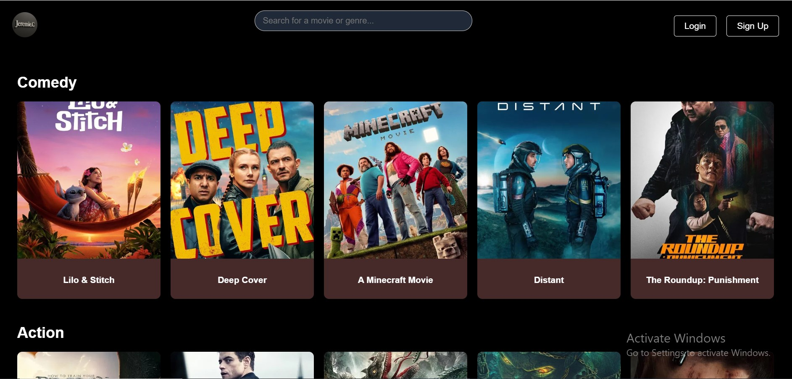

# 🎬 Movie Galaxy – Movie Streaming App

A modern movie streaming interface built with **React + Vite**, Firebase Authentication (Email + Google), and **The Movie Database (TMDb)** API. Users can browse by genre, view detailed movie information, and get personalized recommendations.

---

## 📑 Table of Contents

- [Overview](#overview)
- [Features](#features)
- [Screenshots](#screenshots)
- [Live Demo](#live-demo)
- [Built With](#built-with)
- [Setup & Installation](#setup--installation)
- [Project Structure](#project-structure)
- [Environment Variables](#environment-variables)
- [What I Learned](#what-i-learned)
- [Future Improvements](#future-improvements)
- [Author](#author)
- [Acknowledgments](#acknowledgments)

---

## 🔍 Overview

**Movie Galaxy** allows users to:

- 🔎 Browse and filter movies by genre
- 📺 View trailers and details for each movie
- 💡 Get personalized recommendations
- 🔐 Sign in with Email/Password or Google
- 🌓 Toggle between Dark and Light mode
- 📱 Enjoy a responsive, mobile-first UI

---

## ✅ Features

- 🔐 Firebase Authentication (Email)
- 🌍 Dynamic movie data from TMDb
- 📂 Paginated genre pages with Next/Prev buttons
- 🎥 Video trailer integration
- 🔍 Search for any movie or genre
- 🎭 Personal recommendation page using localStorage
- 💡 Dark Mode toggle (default ON)
- 🔒 Auth-guarded routes
- 📱 Fully responsive (mobile & desktop)

---

## 🖼 Screenshots

> Replace with your actual screenshots

  

---

## 🔗 Live Demo

🌍 [**View Live on Netlify**](https://movie-galaxy.netlify.app)  
🔑 Use a test email to log in.

---

## 🛠 Built With

- ⚛️ React + Vite
- 🔥 Firebase Authentication + Firestore
- 🎬 TMDb API
- 🧭 React Router
- 📦 Axios
- 💡 React Context (for dark mode)
- 📱 CSS Flexbox/Grid + Mobile-first design
- 🚀 Netlify for deployment


---

## ⚙️ Setup & Installation

1. **Clone the repo**
   ```bash
   git clone https://github.com/JEREMIAHCHUKWUEMEKA/movie-website.git
   cd movie-website

---

 ## 📁 Project Structure 
src/
├── assets/
│   ├── components/        
│   ├── pages/             
│   ├── Services/          
│   ├── utils/                     
├── App.jsx
├── main.jsx

---

## 🌍 Environment Variables

Stored in .env and accessed via import.meta.env.VITE_...

VITE_FIREBASE_API_KEY

VITE_FIREBASE_AUTH_DOMAIN

VITE_FIREBASE_PROJECT_ID

VITE_FIREBASE_STORAGE_BUCKET

VITE_FIREBASE_MESSAGING_SENDER_ID

VITE_FIREBASE_APP_ID

VITE_TMDB_API_KEY

---

## 🧠 What I Learned
🔐 Securing Firebase credentials with Vite env vars

⚙️ Handling dynamic routing in React Router

🎞 Working with external APIs (TMDb) for movies/trailers

🔁 Pagination logic in batches (5-page chunks)

🔍 Search functionality across genres and titles

---

## 👤 Author
Jeremie Chukwuemeka

---

## 🙏 Acknowledgments
Big thanks to:

TMDb for the API

Firebase for the auth & backend

Netlify for fast and free hosting
